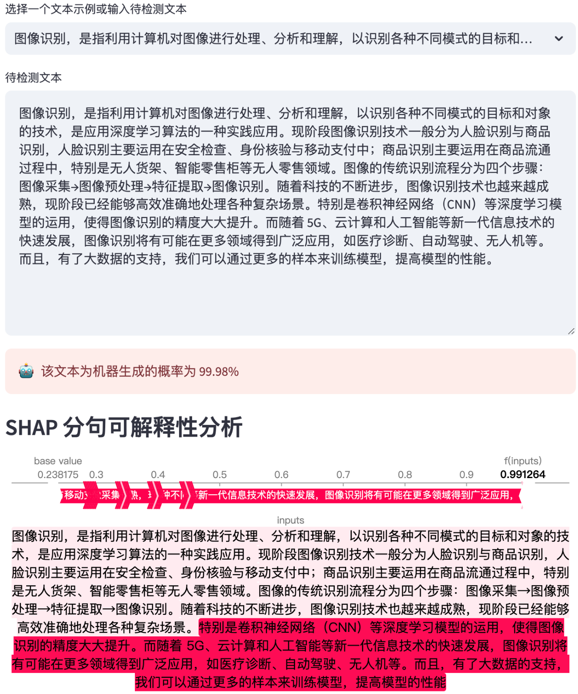

# 机器生成文本检测器



## 简介

本应用使用 BERT 模型和 SHAP 解释性分析技术，旨在帮助用户判断一个文本是否可能由机器生成。应用允许用户输入文本，然后使用预先训练好的 BERT 模型进行分析，最后通过 SHAP 提供文本的可解释性分析，帮助理解模型的预测结果。

## 功能

- **文本输入**：用户可以从预设的文本示例中选择，或者输入自定义的文本进行检测。
- **机器生成文本概率评估**：应用将显示文本被判断为机器生成的概率。
- **SHAP 分句可解释性分析**：对于给定的文本，应用将展示哪些部分对模型的判断起到了决定性作用。

## 安装

1. 克隆仓库或下载代码到本地。
2. 本项目使用以下依赖：
   ```
   matplotlib==3.10.7
   shap==0.48.0
   streamlit==1.51.0
   torch==2.6.0
   transformers==4.51.1
   ```
3. 在命令行中运行 `streamlit run app.py` 启动应用。

## 注意事项

- 应用需要一定时间来加载模型和分析文本，请耐心等待。
- SHAP 可解释性分析需要至少 2 句话（以句号、问号、感叹号为划分），过短的文本可能无法进行分析。

## 致谢

- [shap](https://github.com/shap/shap)
- [streamlit](https://streamlit.io/)
- [streamlit-shap](https://github.com/snehankekre/streamlit-shap)
- [huggingface](https://huggingface.co/)
